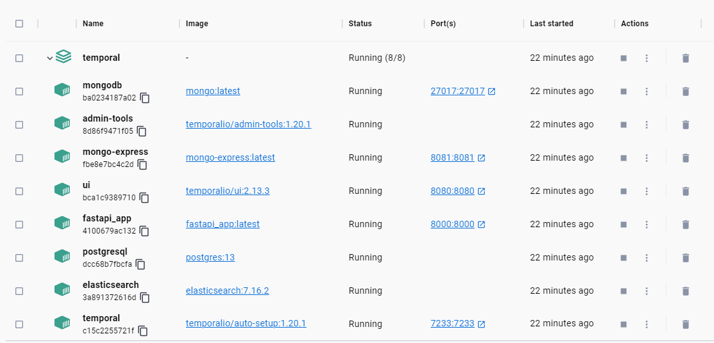
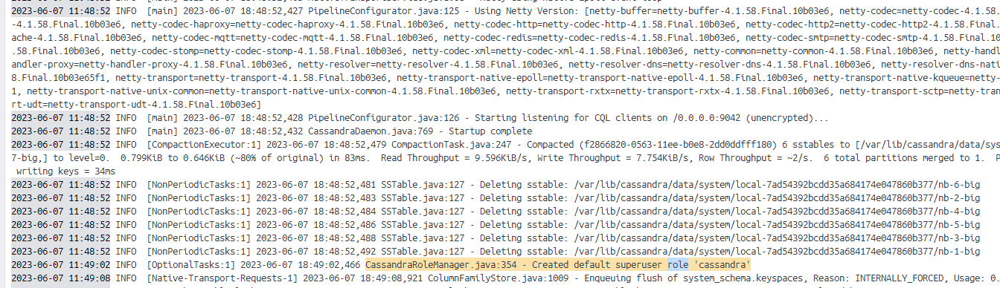
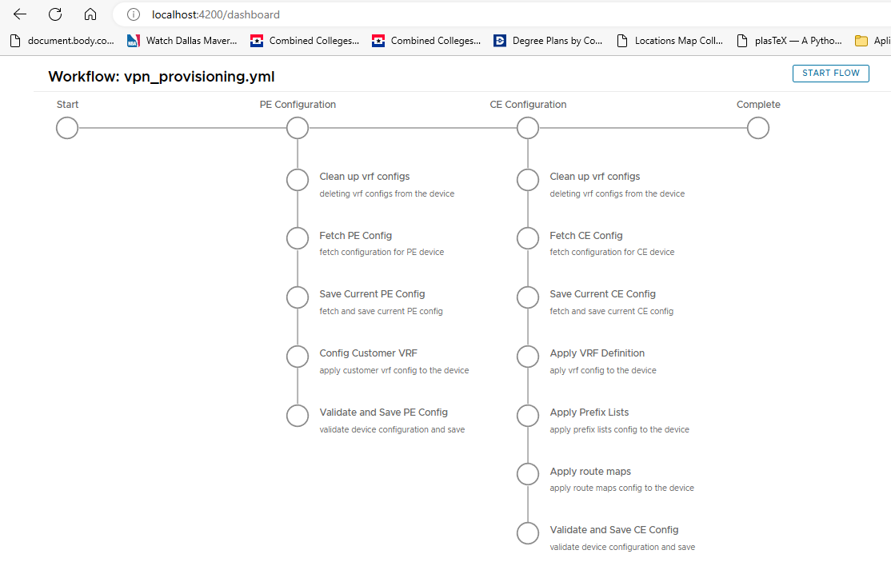
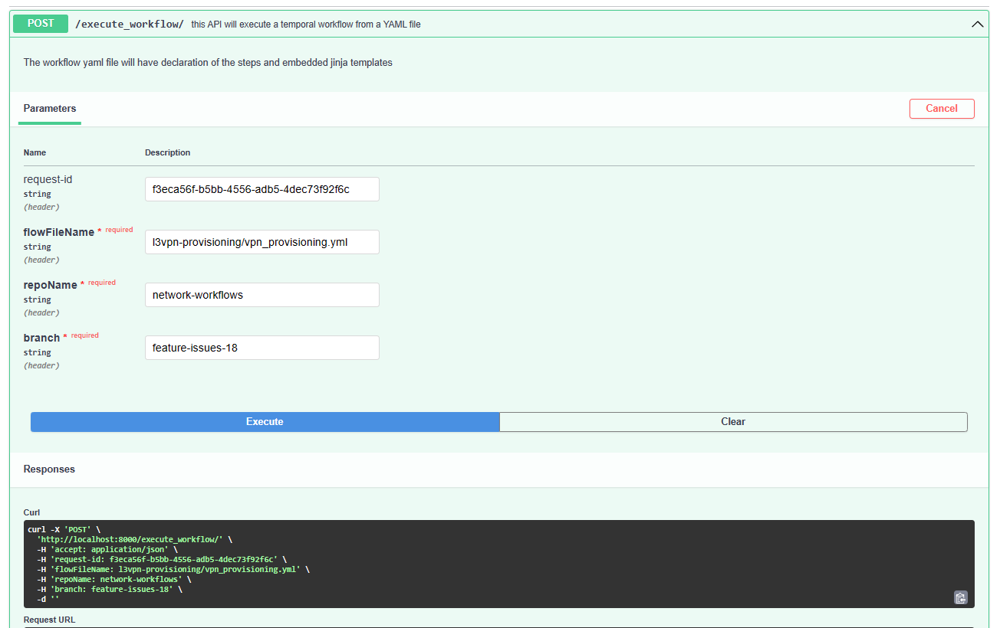
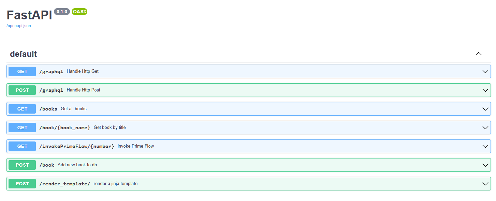
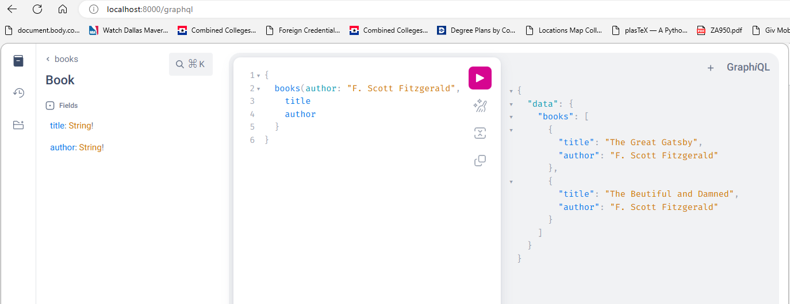
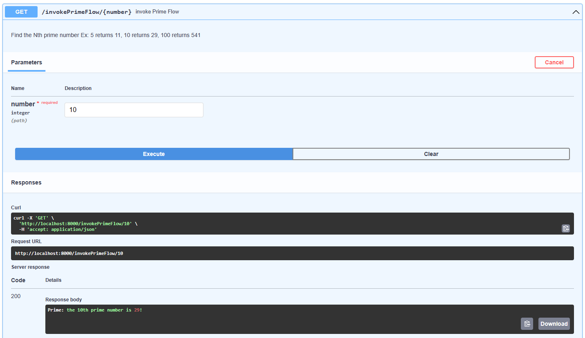
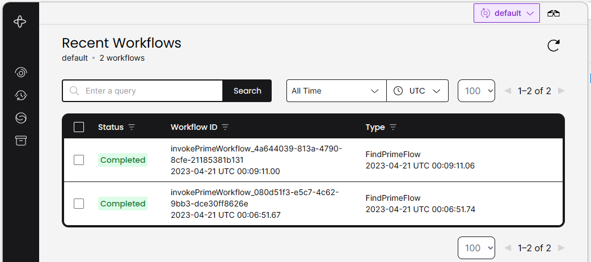
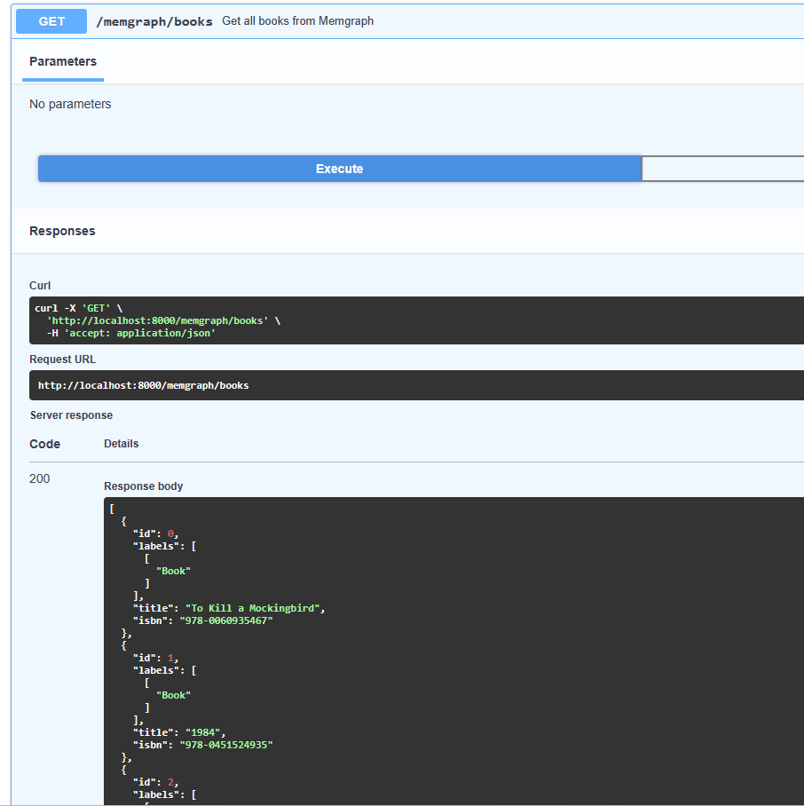
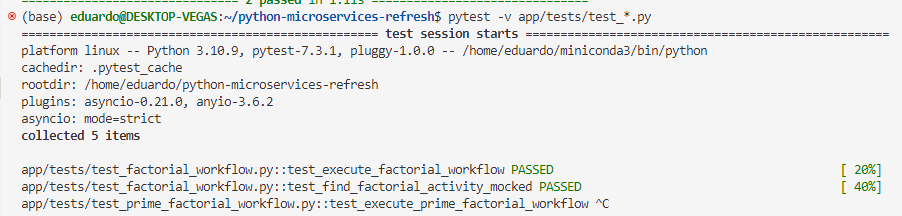

## <b>1. Start the containers</b>
Start the containers with --build param to reflect frequent changes in the python code

`clear; docker-compose down --volumes; docker-compose up --build`


## <b>2. Wait around 30 seconds</b>
Wait for Cassandra gossip to settle, (around 30 seconds)


## <b>3. Launch the UI</b>
After the cassandra role is created launch the UI `http://localhost:4200`

3.1 Hit the start flow button to trigger flow



### <b>4. Hit the execute_workflow API form swagger</b>
http://localhost:8000/docs#/default/execute_workflow_execute_workflow__post

### <b>Scenario 1 Valid workflow params</b>

This scenario will execute a valid workflow, cloning and reading the templates from the repo, then executing the workflow steps

curl -X 'POST' \
  'http://localhost:8000/execute_workflow/' \
  -H 'accept: application/json' \
  -H 'request-id: f3eca56f-b5bb-4556-adb5-4dec73f92f6c' \
  -H 'flowFileName: l3vpn-provisioning/vpn_provisioning.yml' \
  -H 'repoName: <b>network-workflows</b>' \
  -H 'branch: feature-issues-18' \
  -d ''

### <b>Scenario 2 fake repoName</b>

curl -X 'POST' \
  'http://localhost:8000/execute_workflow/' \
  -H 'accept: application/json' \
  -H 'request-id: f3eca56f-b5bb-4556-adb5-4dec73f92f6c' \
  -H 'flowFileName: l3vpn-provisioning/vpn_provisioning.yml' \
  -H 'repoName: <b>non-existent-repo</b>' \
  -H 'branch: feature-issues-18' \
  -d ''



## <b>(Optional) To test code using sandbox.py</b>
Do step #1 only once...

then run `cd app; python sandbox.py --env-file=env/app-local.properties`

this will help testing parts of the services without shutting down the containers and rebuilding them again

<!-- # python-microservices-sandbox
This will create a Mongodb, Temporal IO, GraphQL, FastAPI, Memgraph sandbox POC development

## Start the containers
Start the containers with --build param to reflect frequent changes in the python code
`clear; docker-compose down --volumes; docker-compose up --build`


## Swagger
Access the swagger endpoint
[http://localhost:8000/docs](http://localhost:8000/docs)



## Graphql
Access the grapql endpoint 
[http://localhost:8000/graphql](http://localhost:8000/graphql), use query below
```
{
  books(author: "F. Scott Fitzgerald", title: "") {
    title
    author
  }
}
```


## Temporal IO test
To test the temporal IO setup use the below endpoint
```
curl -X 'GET' \
  'http://localhost:8000/invokePrimeFlow/5' \
  -H 'accept: application/json'
```

Then navigate to the temporal ui to see the flows
http://localhost:8080/namespaces/default/workflows


## Memgraph setup and API end endpoint
Memgraph is graph db that supports Cypher Query Language and is compatible with Neo4j. Memgraph is implented in C++ and runs in memory, making it 120x faster than Neo4j.

Below is an API endpoint which fetches Book nodes from the memgraph db


## Testing
To run the tests simply run
```
pytest -v app/tests/test_*.py
```


## TODO
- Refactor code following MVC pattern using FastAPI Routers
- <s>Create a new workflow that uses context and multiple activites<s>
- <s>Update tests for existing workflow<s>
- <s>Fix test_execute_prime_factorial_workflow<s>
- <s>Add Neo4j database and API endpoint<s> -->